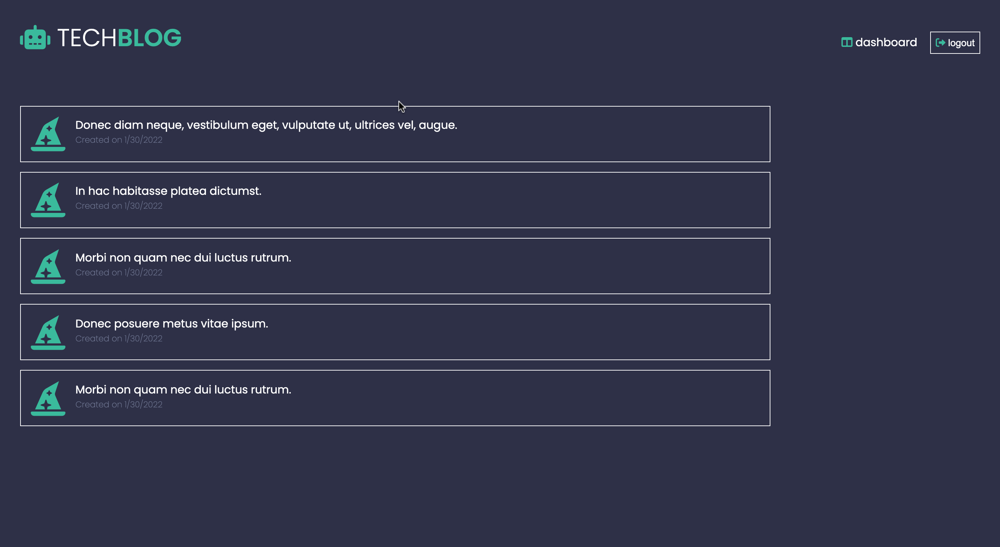

# Tech Blog - Homework # 14
## Project Description 
Online tech blog that allows users to create an account, make posts and comment on other posts. 

### Built With 
- HTML
- CSS 
- Javascript
- Express
- Express-Handlebars
- Express-Sessions
- bcrypt
- dotenv
- MySQL
- dbSeed
- Google Fonts 
- Awesome Icons  

### Files & Directories 
- config
    - connection.js
- db
    - schema.sql
- models
    - Comment.js
    - index.js
    - Post.js
    - User.js
- public
    - javascript
        - add-post.js
        - comment.js
        - delete-post.js
        - edit-post.js
        - login.js 
        - logout.js
    - stylesheets
        - style.css
- routes 
    - api 
        - comment-routes.js
        - index.js
        - post-routes.js
        - user-routes.js
    - dashboard-routes.js
    - home-routes.js
    - index.js
- seeds
    - comment-seeds.js
    - index.js
    - post-seeds.js
    - user-seeds.js
- utils
    - auth.js
    - helpers.js
- views
    - layouts
        - main.handlebars
    - partials 
        - comment-form.handlebars
        - comment.handlebars
        - login-info.handlebars
        - post-info.handlebars
        - post-overview.handlebars
    - dashboard.handlebars
    - edit-post.handlebars
    - homepage.handlebars
    - login.handlebars
    - single-post-handlebars
- README.md
- server.js

## Example of Functionality 

## Instructions 
1. Fork and clone repository
2. Create directory under /develop
3. Add static content to /develop
4. Commit changes to repository
5. Deploy repository to hosting service

## Checkout the Live Version of the Site
[Tech Blog](https://fast-meadow-36525.herokuapp.com/)

## Editor Information 
Created and maintained by Ashley Viola 
